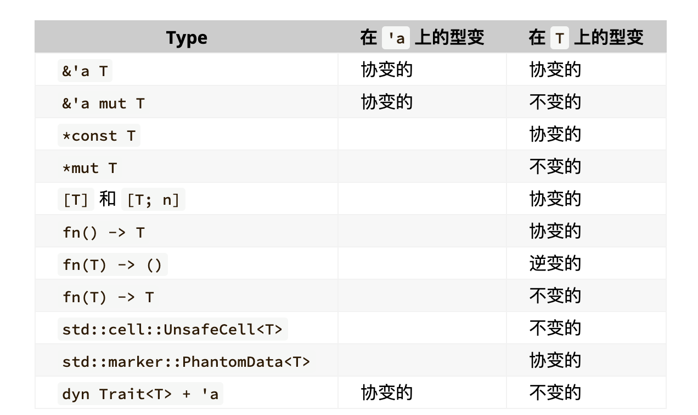

# 类型系统



## 学会如何看表

首先，有 `'a` 的东西，就说明是引用，暂时不管 `dyn Trait<T> + 'a`。
那么引用的生命周期就是值得探讨的。

那么就是要看 这个 `'a` 的来源了。
考虑几种情况会导致 "来源" 这件事情发生：

1. assign

```rust
let x: &'a T = y: &'b T
```

这也就是：`'b <: 'a`（`'a`上的 variant）。
肯定是：y 是 x 的 subtype ，否则就没法进行 assign 操作。

2. args to params

其实这个与 assign 是一回事：`assign param : &'a T = args : &'b T`，
这也是 `'b <: 'a`

3. params to retval

首先，返回引用的生命周期是不可能凭空产生的，
只能来自于 param，然后 param 又来自于 args。
"来自于哪" 这个句子 就与 "assign" 很像了。

考虑：

```rust
fn foo(&'a T) -> &'b T
```

这个又与 `let b : &'b T = a : &'a T` 很像。因此：`a <: b`。

## 可变引用 T 的 in_variant

假设有两个结构体`Animal`和`Dog`，其中`Dog`是`Animal`的子类型：

```rust
struct Animal {
    name: String,
}

struct Dog extends Animal {
    name: String,
    breed: String,
}

let mut dog = Dog {
    name: "Buddy".to_string(),
    breed: "Golden Retriever".to_string(),
};

let animal_ref: &mut Animal = &mut dog; // FIX 这里有问题
```

我们知道 借用 是指针(抽象越级了)。我们想到了 C++ 中的指针是可以为所欲为的。
那么其实 Animal 的指针依然可以修改 dog 的 breed 字段。
尽管 breed 并没有 breed 字段。

鲁迅曾经说过：要让 api 易于正确使用。

## T 的 co_variant

```rust
class Animal {}
class Dog: Animal {}
```

现在，考虑到 Rust 的协变性规则，我们可以看一个具体的例子：

```rust
fn print_animal_name(animal: &Animal) {
    // 假设Animal有一个name字段
    println!("Animal's name: {}", animal.name);
}

fn main() {
    let dog = Dog { name: "Buddy" };
    let animal_ref: &Animal = &dog; // 因为&T协变, 所以&Dog可以被看作&Animal

    print_animal_name(animal_ref);
}
```

在这个例子中，尽管`print_animal_name`函数期望一个指向`Animal`的引用，我们仍然可以传递一个指向`Dog`的引用。
这是因为`&Dog`可以被安全地"提升"为`&Animal`，这正是因为引用的协变性质。

#### 生命周期示例

对于生命周期的协变性，考虑以下情形：

```rust
fn get_short_lived_ref<'a>(data: &'a i32, flag: bool) -> &'a i32 {
    let short_lived = 10;
    if flag {
        &short_lived
    } else {
        data
    }
}
```

对于函数来说：`args <: retval`

## contra_variant

这个东西也很操蛋：

```rust
fn(T) -> () // 的 contra_variant 包含 'lifetime 之类的
```

怎么解释？

一般来说： `'static <: 'a`，
但是在 `fn(T) -> ()` 却是这样的效果： `fn(&'a) <: fn(&'static)`

这个就是 contra_variant ， 就是这么通俗

## co_variant

什么叫做 T 上的 covariant ？

比方说： rust 中没有 继承。但是有 trait

```rust
trait Animal {
    fn make_sound(&self);
}

struct Dog;

impl Animal for Dog {
    fn make_sound(&self) {
        println!("Bark!");
    }
}

// 这个函数接受一个实现了 Animal 特征的类型的不可变引用
fn animal_sound(animal: &dyn Animal) {
    animal.make_sound();
}

fn main() {
    let my_dog = Dog;
    // 尽管我们具体传递了 Dog 类型，但是因为 &Dog 可以被安全地转换为 &dyn Animal（协变性）
    // 这里我们可以调用 animal_sound 并传入 &Dog
    animal_sound(&my_dog);
}
```

## mut 与 immut

### 不可变指针 可变对象

```rust
fn main() {
    let mut data: i32 = 10;
    let p1: &mut i32 = &mut data; // 不可变指针指向可变数据
    *p1 = 100;
    // p1 = &mut x; // ERROR
    println!("{data}")
}
```

可以看到 p1 的数据类型是 `&mut i32`，然后他也可以修改 指向的数据。

### 可变指针 可变对象

```rust
fn main() {
    let mut data2: i32 = 10;
    let mut p2: &mut i32 = &mut data2; // 不可变指针指向可变数据
    let _p2: &mut &mut i32 = &mut p2;
}
```

从 `_p2` 可以看到，p2 的类型应该是 `mut &mut i32` 或者是 `&mut i32`，
不知道将他的 mut 直接作为类型是否合适。

### 可变指针 不可变对象

```rust
fn main() {
    let data3: i32 = 10;
    let mut p3: &i32 = &data3;
    let _p3: &mut &i32 = &mut p3;
    println!("*p3={}", *p3);  // 10
    println!("*p3={}", p3);  // 10
}
```

从 `_p3` 可以看到，p3 的类型应该是 `mut &i32` 或者是 `&i32`

### 不可变指针 不可变对象 （这个没啥好说的）

## 占位 与 推断

rust 中， 占位 与 推断的符号都是 `_`

```rust
fn foo(x: &str, y: &'_ str) -> &'_ str {}
```

y 的`'_`表示占位；return `'_`表示生命周期的推断。
y 的`'_`表示：使用了特定的生命周期。因此 retval 的 lifetime
只能来自于 x 。这真的很操蛋

## 一些想法

生命周期是 类型系统的一部分。 类型系统其实并没有什么，
每个语言都有类型系统。类型系统一方面来说是没有意义的，
因为 汇编语言实际上并不关注 类型，而是关注读写多少内容。
但是我们都知道，类型系统是很重要的。

就像生命周期，可能只是给 rust 编译器看的，但是确实重要。
